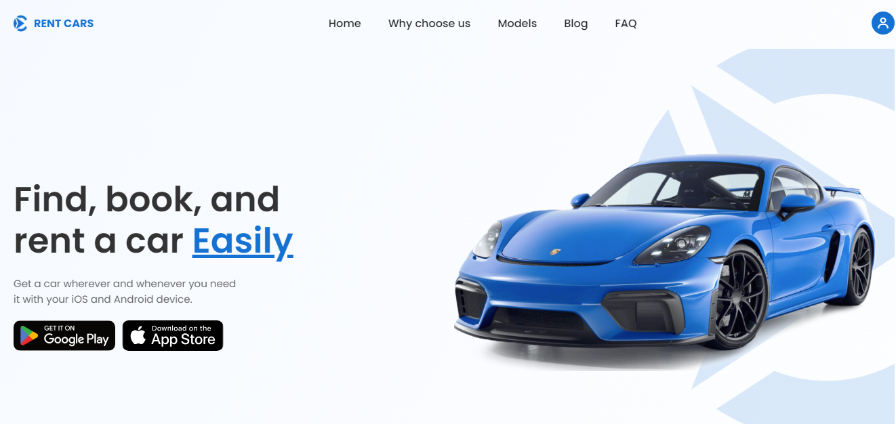

# PP - 003 Car rental 

## Overview
This is my personal project based on a car rental design on **`Figma`**.
I felt this would provide valuable experience using Figma and would mirror how professional developers operate using UI/UX designs.

 This was based on a Figma design from Truong Huy.
 Figma Design: (https://www.figma.com/design/c9RdyLpBnxBgnDRFnf1Uo1/Rent-Car---Landing-page-(Community)?node-id=2205-176&node-type=frame&t=0c2Q7KCIESEyEhK3-0)

### Screenshot

### Links

- Solution URL: (https://rajancp.github.io/PP-003-Car-rental-figma/)

### Built with

## Author

- Frontend Mentor - [@RajanCP](https://www.frontendmentor.io/profile/RajanCP)
- GitHub - [@RajanCP] (https://github.com/RajanCP)

